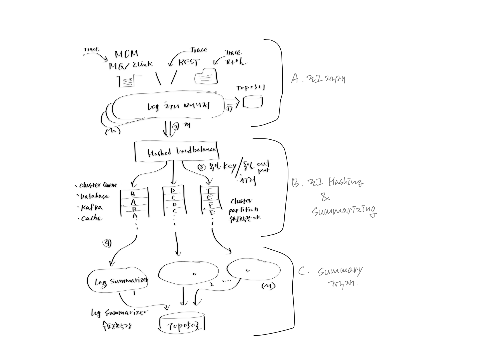
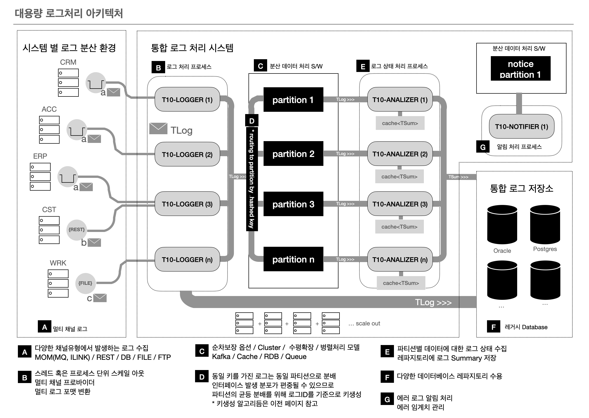

<!--
### We are working on a small project for big data log processing. 👋
---
- 🔭 I’m currently working on ...
  ---
  * 탭 블릿 표시 예
  * **Bold**
  * > 인용문입니다.
    >> 인용에 인용입니다.
  * 
  * 
  1. 숫자
  2. 2번째
  마크다운 참고 : 
    https://www.markdownguide.org/getting-started/
  마크다운 툴 :
    https://dillinger.io
-->

### 빅데이터 로그 처리를 위한 작은 프로젝트를 하나 진행하고자 합니다.

#### 0. 개발의 동기 🤔 
  > 오랜동안 EAI 개발 부문에서 종사해온 저는 여러 시스템에서 발생하는 로그를 적절할게 수집하여
  > 원하는 형태로 서비스를 제공하는 기술에는 익숙하나,
  > 성능적 측면에서는 단일 시스템(1대의 하드웨어 기준)하에서 하루 수 억 건 이상 처리가
  > 필요한 환경은 마주하지 못했던 터라, 수억 건 이상의 대량 데이터를 처리하는 단일 시스템을 설계하고
  > 더 나아가 횡으로 증가 가능한 제품을 개발해 보면 재밌겠다는 생각을 해보게 되었습니다.
  > 대량 데이터를 처리할 기반 여건(H/W, S/W)은 부족하나 아무쪼록 없는 자원 하에서 최대치의 데이터를
  > 처리할 수 있는 단일 소프트웨어를 개발할 수 있도록 하여 이상적이지만(하드웨어의 한계 제외)
  > 병렬 노드(H/W) 추가만으로 얼마든지 무한대의 데이터를 처리 가능하다는 것을 증명해 보일 수 있으면 하는 바램입니다.   

#### 1. 프로젝트 목표 및 제한 사항은 다음과 같습니다.
  * 단일 시스템 기준 일 1~2억 건의 데이터 처리가 가능한 성능
  * 다양한 환경에서 변경없이 사용 가능하도록 일반화하기
  * 주말에만 개발하기
  * 1인 개발자

#### 2. 대략적인 아키텍처는 다음과 같습니다.
[아이디어] 

[아키텍처] 

#### 3. 필요한 기술 스택은 다음과 같습니다.
  * Spring
  * Java
  * Sql
  * Kafka

#### 4. 프로젝트 일정
  - 사용 기술 검증 및 성능 체크를 위한 준비 : 1개월
  - 사용 기술 검증 및 성능 체크 : 1개월
  - 결과 리뷰 및 개발 여부 판단
  - 설계
  - 개발

#### 자 이제 배를 띄웠으니 포기하지 않는 일 만 남았습니다. 앞으로 진행사항에 따라 계속 문서는 업데이트될 예정입니다. 

[다음 👽 디자인](./design.md)

[english]

We are working on a small project to process big data logs.

Project goals and limitations are listed below.
* Improve performance by choosing one of our in-house products.
* Generalize so that it can be used elsewhere.
* Do not use company resources.
* Performance capable of processing 100 million to 200 million data per day based on a single system

The system architecture is as follows:

[Figure 1 Architecture]

The technology stack to be used is as follows:

[Figure 2 Technology Stack]

project schedule
- Preparation for technology verification and performance check: 1 month
- Technology verification and performance check: 1 month
- Review results and determine whether to develop
- design
- Development
